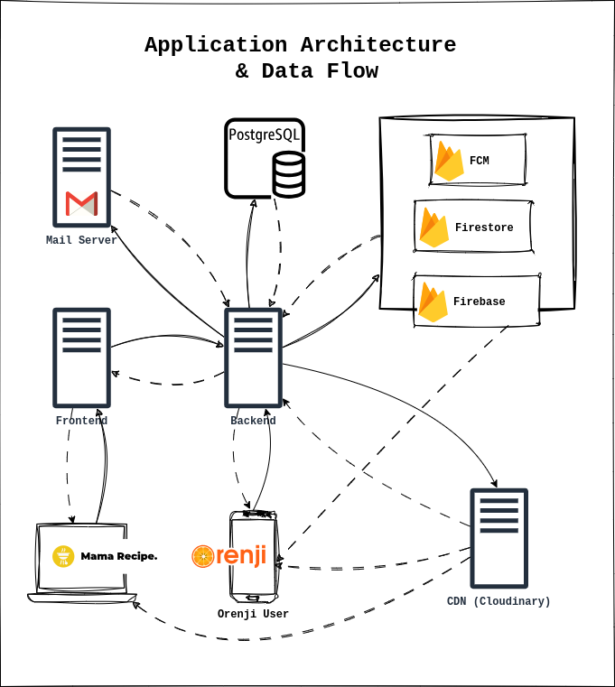
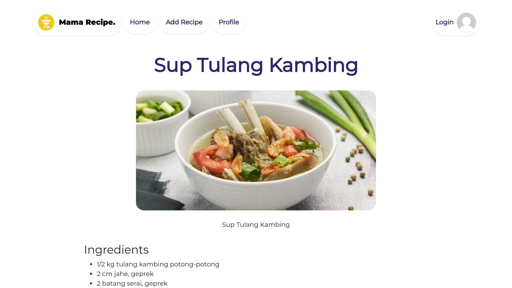
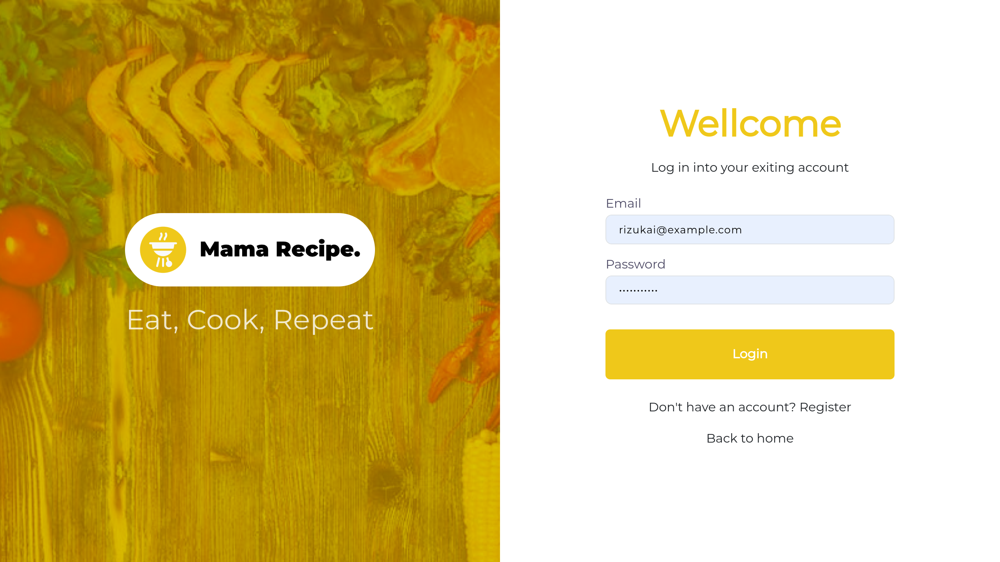

# Mama Recipe x Orenji -  Backend

  
This is a repository for Mama Recipe and Tomato, both are same application while Tomato is a fork from Mama Recipe Project. This Project is about a recipe applicaion that has a service like adding,save,favorite,like recipe, and other.

Developer :

> 

Check this link to view the Mama Recipe Web : <https://recipes-web-fe.vercel.app/>

## How to run  

On Local :

1. Clone this repository ``https://github.com/Team-A-Pijarcamp-Batch-15/receipes-web-be``
2. Install the dependencies with command  ``npm install``  
3. Setup the Environment variable, an ``.env.exampe`` there at the root of this project.
4. Run with command ``npm run start`` or for the next using ``npm run dev``

note that npm run start will also running the migration database, so please configure the environment properly.

## Architecture

## Screenshoots

### Home

  

### Recipe Detail

### Recipe Login Register

Note that login register has same design.

